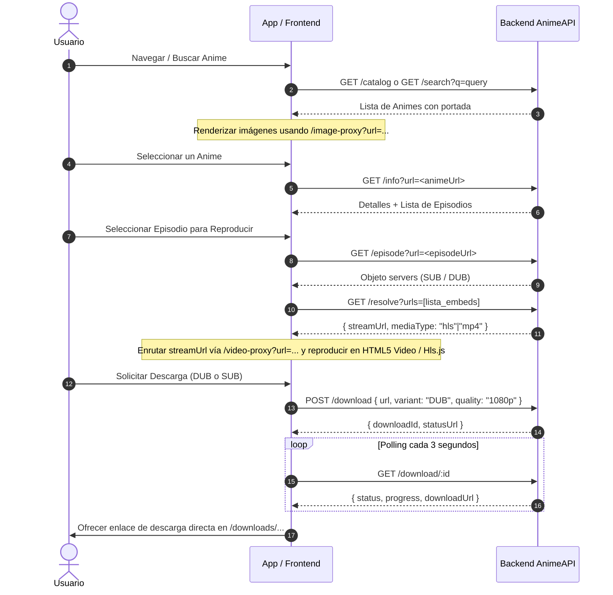

# API de Anime (ANIME1V) — Documentación Oficial de Endpoints

Esta documentación describe en detalle la totalidad de las rutas, parámetros, autenticación, respuestas y flujos de trabajo disponibles en la API **ANIME1V**.

---

## 📌 Información General

- **Rutas base soportadas:**
  - `/api/v1/anime` (Recomendada)
  - `/api/anime1v` (Alias idéntico)
- **Formato de datos:** JSON (UTF-8) salvo en los endpoints de proxy/descarga estática que entregan flujos binarios (`arraybuffer` / `stream` / `m3u8`).
- **Encabezados por defecto:** La API añade `Cache-Control: no-store` en respuestas dinámicas `/api/*`.

---

## 📋 Índice de Endpoints

1. [🔑 Autenticación y Control de Tráfico](#-autenticación-y-control-de-tráfico)
2. [🩺 Estado del Servidor](#-1-estado-del-servidor-get-health)
3. [📚 Catálogo de Animes](#-2-catálogo-de-animes-get-apiv1animecatalog)
4. [🔍 Búsqueda de Animes](#-3-búsqueda-de-animes-get-apiv1animesearch)
5. [🆕 Últimos Episodios Publicados](#-4-últimos-episodios-publicados-get-apiv1animelatest-episodes)
6. [🔥 Animes Populares / Trending](#-5-animes-populares--trending-get-apiv1animetrending)
7. [📅 Calendario de Emisión](#-6-calendario-de-emisión-get-apiv1animeschedule)
8. [🔮 Predicción de Próximos Episodios](#-7-predicción-de-próximos-episodios-get-apiv1animepredict-episodes)
9. [🏷️ Géneros y Filtros Disponibles](#-8-géneros-y-filtros-disponibles-get-apiv1animegenres)
10. [ℹ️ Información Detallada de un Anime](#-9-información-detallada-de-un-anime-get-apiv1animeinfo)
11. [🔗 Animes Relacionados](#-10-animes-relacionados-get-apiv1animerelated)
12. [🎥 Enlaces y Servidores de un Episodio](#-11-enlaces-y-servidores-de-un-episodio-get-apiv1animeepisode)
13. [⚡ Resolver Enlace a Stream Directo](#-12-resolver-enlace-a-stream-directo-get-apiv1animeresolve)
14. [📥 Crear Descarga Individual](#-13-crear-descarga-individual-post-apiv1animedownload)
15. [📊 Estado de Descarga Individual](#-14-estado-de-descarga-individual-get-apiv1animedownloadid)
16. [📦 Crear Descarga por Lotes (Batch)](#-15-crear-descarga-por-lotes-batch-post-apiv1animebatch-download)
17. [📊 Estado de Descarga por Lotes](#-16-estado-de-descarga-por-lotes-get-apiv1animebatchid)
18. [💾 Servir Archivos Descargados](#-17-servir-archivos-descargados-get-downloadsfilename)
19. [🖼️ Proxy de Imágenes](#-18-proxy-de-imágenes-get-apiv1animeimage-proxy)
20. [🎬 Proxy de Video y Manifiestos HLS](#-19-proxy-de-video-y-manifiestos-hls-get-apiv1animevideo-proxy)
21. [🌐 Proveedores Soportados](#-proveedores-soportados)
22. [🔄 Flujo de Integración Recomendado](#-flujo-de-integración-recomendado)
23. [⚠️ Manejo de Errores y Códigos HTTP](#-manejo-de-errores-y-códigos-http)

---

## 🔑 Autenticación y Control de Tráfico

Todos los endpoints (a excepción de `/health`, `/image-proxy`, `/video-proxy` y descargas directas bajo `/downloads/`) requieren autenticación mediante **API Key**.

### Formas de enviar la API Key

1. **Mediante Encabezado HTTP (Recomendado):**
   ```http
   x-api-key: TU_API_KEY
   ```
2. **Mediante Parámetro Query:**
   ```http
   GET /api/v1/anime/catalog?apiKey=TU_API_KEY
   ```

### Límite de Peticiones (Rate Limit)

- **Límite:** 200 peticiones diarias por clave API (o por IP si la autenticación está desactivada).
- **Reinicio:** Se reinicia automáticamente cada día a las `00:00 UTC`.
- **Modo Desarrollo:** Si la variable de entorno `DISABLE_AUTH=true` está activa en el servidor, no se requiere API Key.

---

## 🩺 1. Estado del Servidor (`GET /health`)

Verifica que el servidor esté activo y respondiendo correctamente. **No requiere autenticación.**

```http
GET /health
```

### Ejemplo de Respuesta (`200 OK`)
```json
{
  "success": true,
  "status": "ok"
}
```

---

## 📚 2. Catálogo de Animes (`GET /api/v1/anime/catalog`)

Obtiene la lista paginada de animes permitiendo filtrar por género, tipo, estado, año, ordenación, letra inicial o término de búsqueda.

```http
GET /api/v1/anime/catalog
```

### Parámetros Query

| Parámetro | Tipo | Requerido | Descripción |
|---|---|---|---|
| `page` | number | No | Número de página (empieza en 1). Por defecto `1`. |
| `genre` | string | No | Slug del género (ej. `accion`, `comedia`, `isekai`). |
| `type` | string | No | Tipo de contenido: `tv-anime`, `pelicula`, `ova`, `especial`, `ona`. |
| `sort` | string | No | Criterio de ordenación: `default`, `rating`, `popular`, `latest`, `title`. |
| `status` | string | No | Estado de emisión: `en-emision`, `finalizado`, `proximamente`. |
| `year` | string | No | Año exacto de emisión (ej. `2025`). |
| `minYear` | string | No | Año mínimo del rango. |
| `maxYear` | string | No | Año máximo del rango. |
| `letter` | string | No | Letra inicial del título (`A`-`Z`). |
| `q` | string | No | Término de búsqueda rápida dentro del catálogo. |
| `provider` | string | No | Proveedor a consultar: `animeav1`, `animeflv` (Por defecto `animeav1`). |

> **Nota de Compatibilidad:** Solo los proveedores `animeav1` y `animeflv` implementan `getCatalog` nativo. Si especifica otro proveedor, la API utilizará `animeav1` de manera automática como fallback.

### Ejemplos de Petición
```http
GET /api/v1/anime/catalog?page=1
GET /api/v1/anime/catalog?genre=accion&type=tv-anime&sort=popular
GET /api/v1/anime/catalog?status=en-emision&sort=latest&year=2025
GET /api/v1/anime/catalog?provider=animeflv&page=2
```

### Ejemplo de Respuesta (`200 OK`)
```json
{
  "success": true,
  "data": {
    "page": 1,
    "genre": "accion",
    "results": [
      {
        "id": 4763,
        "title": "One Piece",
        "slug": "https://animeav1.com/media/one-piece",
        "url": "https://animeav1.com/media/one-piece",
        "image": "https://cdn.animeav1.com/covers/4763.jpg",
        "backdrop": null,
        "type": "TV Anime",
        "score": 8.73,
        "status": "En emision",
        "year": "1999",
        "malId": 21,
        "provider": "animeav1"
      }
    ],
    "count": 24,
    "hasMore": true
  },
  "source": "json"
}
```

---

## 🔍 3. Búsqueda de Animes (`GET /api/v1/anime/search`)

Realiza una búsqueda de animes por título. Si no se especifica el parámetro `domain` o `provider`, la API consulta **todos los proveedores en paralelo**, deduplicando los resultados y ponderándolos por relevancia.

```http
GET /api/v1/anime/search
```

### Parámetros Query

| Parámetro | Tipo | Requerido | Descripción |
|---|---|---|---|
| `q` | string | **Sí** | Cadena o nombre del anime a buscar. |
| `domain` | string | No | Dominio o ID del proveedor para forzar la búsqueda en uno solo (`jkanime.net`, `animeflv`, `animeav1`, `tioanime`, `monoschinos`, `hentaila`). |
| `provider` | string | No | Alias para `domain`. |

### Ejemplos de Petición
```http
GET /api/v1/anime/search?q=solo leveling
GET /api/v1/anime/search?q=naruto&domain=animeflv
GET /api/v1/anime/search?q=dragon ball&provider=jkanime
```

### Ejemplo de Respuesta Multi-Proveedor (`200 OK`)
```json
{
  "success": true,
  "source": "Multi",
  "data": {
    "query": "solo leveling",
    "results": [
      {
        "title": "Solo Leveling",
        "slug": "https://animeav1.com/media/solo-leveling",
        "url": "https://animeav1.com/media/solo-leveling",
        "image": "https://cdn.animeav1.com/covers/5120.jpg",
        "type": "TV Anime",
        "provider": "AnimeAV1"
      },
      {
        "title": "Solo Leveling: Arise",
        "url": "https://animeflv.net/anime/solo-leveling-arise",
        "image": "https://animeflv.net/uploads/animes/covers/3920.jpg",
        "provider": "AnimeFLV"
      }
    ],
    "count": 2
  }
}
```

---

## 🆕 4. Últimos Episodios Publicados (`GET /api/v1/anime/latest-episodes`)

Obtiene la lista de los últimos episodios lanzados recientemente por el proveedor seleccionado.

```http
GET /api/v1/anime/latest-episodes
```

### Parámetros Query

| Parámetro | Tipo | Requerido | Descripción |
|---|---|---|---|
| `provider` | string | No | ID del proveedor (`animeav1`, `jkanime`, `hentaila`). Si se omite, se utiliza `animeav1`. |

### Ejemplos de Petición
```http
GET /api/v1/anime/latest-episodes
GET /api/v1/anime/latest-episodes?provider=jkanime
```

### Ejemplo de Respuesta (`200 OK`)
```json
{
  "success": true,
  "source": "animeav1",
  "data": {
    "results": [
      {
        "title": "One Piece",
        "slug": "one-piece",
        "url": "https://animeav1.com/media/one-piece/1115",
        "image": "https://cdn.animeav1.com/covers/4763.jpg",
        "episode": 1115,
        "timestamp": "2026-09-06T10:00:00.000Z",
        "provider": "AnimeAV1"
      }
    ],
    "count": 10
  }
}
```

---

## 🔥 5. Animes Populares / Trending (`GET /api/v1/anime/trending`)

Devuelve el ranking de animes con mayor puntuación y popularidad entre los que han publicado nuevos episodios dentro del rango de días especificado.

```http
GET /api/v1/anime/trending
```

### Parámetros Query

| Parámetro | Tipo | Requerido | Descripción |
|---|---|---|---|
| `count` | number | No | Cantidad de resultados a retornar (rango: 1 a 50, por defecto `10`). |
| `days` | number | No | Ventana de tiempo en días (rango: 1 a 30, por defecto `7`). |

### Ejemplos de Petición
```http
GET /api/v1/anime/trending
GET /api/v1/anime/trending?count=15&days=14
```

### Ejemplo de Respuesta (`200 OK`)
```json
{
  "success": true,
  "source": "Multi",
  "data": {
    "days": 7,
    "results": [
      {
        "title": "Jujutsu Kaisen Season 2",
        "slug": "jujutsu-kaisen-2nd-season",
        "provider": "AnimeAV1",
        "url": "https://animeav1.com/media/jujutsu-kaisen-2nd-season",
        "image": "https://cdn.animeav1.com/covers/3850.jpg",
        "backdrop": null,
        "score": 8.82,
        "votes": 14200,
        "type": "TV Anime",
        "year": "2023",
        "status": "Finalizado",
        "genres": ["Accion", "Fantasía", "Sobrenatural"],
        "description": "Segunda temporada de Jujutsu Kaisen...",
        "malId": 51009,
        "lastEpisode": { "number": 23, "date": "2026-09-05" }
      }
    ],
    "count": 1,
    "updatedAt": "2026-09-06"
  }
}
```

---

## 📅 6. Calendario de Emisión (`GET /api/v1/anime/schedule`)

Agrupa episodios por fecha (`Hoy`, `Ayer`, `Manana`, o días específicos). En su modo alternativo (`upcoming=true`), calcula y proyecta las fechas futuras de emisión semanal.

```http
GET /api/v1/anime/schedule
```

### Parámetros Query

| Parámetro | Tipo | Requerido | Descripción |
|---|---|---|---|
| `provider` | string | No | Proveedor a consultar (`animeav1`, `jkanime`, `hentaila`). Si se omite, agrupa de todos. |
| `upcoming` | boolean | No | Si es `true`, devuelve episodios proyectados en días futuros. Por defecto `false`. |
| `count` | number | No | Cantidad de episodios futuros a predecir por serie (rango 1-12, por defecto `3`). Aplica si `upcoming=true`. |

### Ejemplos de Petición
```http
GET /api/v1/anime/schedule
GET /api/v1/anime/schedule?upcoming=true&count=5
GET /api/v1/anime/schedule?provider=jkanime
```

### Ejemplo de Respuesta Estándar (`upcoming=false`)
```json
{
  "success": true,
  "source": "animeav1",
  "data": {
    "upcoming": false,
    "groups": [
      {
        "date": "2026-09-06",
        "dateLabel": "Hoy",
        "episodes": [
          {
            "title": "One Piece",
            "slug": "one-piece",
            "url": "https://animeav1.com/media/one-piece/1115",
            "image": "https://cdn.animeav1.com/covers/4763.jpg",
            "episode": 1115,
            "timestamp": "2026-09-06T10:00:00.000Z",
            "provider": "AnimeAV1"
          }
        ]
      }
    ],
    "count": 1
  }
}
```

### Ejemplo de Respuesta Proyectada (`upcoming=true`)
```json
{
  "success": true,
  "source": "animeav1",
  "data": {
    "upcoming": true,
    "groups": [
      {
        "date": "2026-09-13",
        "dateLabel": "Domingo 13",
        "episodes": [
          {
            "title": "One Piece",
            "slug": "one-piece",
            "url": "https://animeav1.com/media/one-piece/1116",
            "image": "https://cdn.animeav1.com/covers/4763.jpg",
            "episode": 1116,
            "airDate": "2026-09-13",
            "dayOfWeek": "Domingo",
            "predicted": true,
            "provider": "AnimeAV1"
          }
        ]
      }
    ],
    "count": 1
  }
}
```

---

## 🔮 7. Predicción de Próximos Episodios (`GET /api/v1/anime/predict-episodes`)

Calcula el calendario preciso de los futuros lanzamientos de un anime en específico basándose en su patrón de emisión.

```http
GET /api/v1/anime/predict-episodes
```

### Parámetros Query

| Parámetro | Tipo | Requerido | Descripción |
|---|---|---|---|
| `url` | string | **Sí** | URL completa o slug del anime. |
| `count` | number | No | Número de capítulos a predecir (1 a 52, por defecto `5`). |

### Ejemplos de Petición
```http
GET /api/v1/anime/predict-episodes?url=https://animeav1.com/media/one-piece&count=4
```

### Ejemplo de Respuesta (`200 OK`)
```json
{
  "success": true,
  "source": "animeav1",
  "data": {
    "id": 4763,
    "title": "One Piece",
    "status": "En emision",
    "startDate": "1999-10-20",
    "pattern": "weekly",
    "nextEpisode": 1116,
    "dates": [
      { "episode": 1116, "airDate": "2026-09-13", "dayOfWeek": "Domingo" },
      { "episode": 1117, "airDate": "2026-09-20", "dayOfWeek": "Domingo" },
      { "episode": 1118, "airDate": "2026-09-27", "dayOfWeek": "Domingo" },
      { "episode": 1119, "airDate": "2026-10-04", "dayOfWeek": "Domingo" }
    ]
  }
}
```

> **Respuesta de Error (`422 Unprocessable Entity`):** Si el anime está finalizado o no posee fecha de inicio conocida para realizar la proyección.

---

## 🏷️ 8. Géneros y Filtros Disponibles (`GET /api/v1/anime/genres`)

Obtiene el listado estructurado de géneros, categorías, tipos y años disponibles para filtrado según el proveedor especificado.

```http
GET /api/v1/anime/genres
```

### Parámetros Query

| Parámetro | Tipo | Requerido | Descripción |
|---|---|---|---|
| `provider` | string | No | Proveedor a consultar (`animeav1`, `tioanime`, `hentaila`). Por defecto `animeav1`. |
| `domain` | string | No | Alias de `provider`. |

### Ejemplos de Petición
```http
GET /api/v1/anime/genres
GET /api/v1/anime/genres?provider=tioanime
```

### Ejemplo de Respuesta (`200 OK`)
```json
{
  "success": true,
  "source": "animeav1",
  "data": {
    "categories": [
      { "id": 1, "name": "TV Anime", "slug": "tv-anime" },
      { "id": 2, "name": "Pelicula", "slug": "pelicula" }
    ],
    "genres": [
      { "id": 1, "name": "Acción", "slug": "accion", "malId": 1 },
      { "id": 2, "name": "Aventura", "slug": "aventura", "malId": 2 },
      { "id": 3, "name": "Comedia", "slug": "comedia", "malId": 4 }
    ],
    "years": [2026, 2025, 2024, 2023, 2022],
    "filters": null,
    "total": 35
  }
}
```

---

## ℹ️ 9. Información Detallada de un Anime (`GET /api/v1/anime/info`)

Retorna toda la metadata de un anime: sinopsis, póster, tipo, año, puntuación, temporada de emisión, géneros y lista completa de episodios.

```http
GET /api/v1/anime/info
```

### Parámetros Query

| Parámetro | Tipo | Requerido | Descripción |
|---|---|---|---|
| `url` | string | **Sí** | URL o slug del anime en la fuente original o en la API. |

### Ejemplos de Petición
```http
GET /api/v1/anime/info?url=https://animeav1.com/media/one-piece
GET /api/v1/anime/info?url=https://animeflv.net/anime/one-piece
```

### Ejemplo de Respuesta (`200 OK`)
```json
{
  "success": true,
  "source": "animeav1",
  "data": {
    "id": 4763,
    "title": "One Piece",
    "titleJapanese": "ONE PIECE",
    "description": "Monkey D. Luffy se niega a permitir que nadie se interponga en su camino para convertirse en el Rey de los Piratas...",
    "image": "https://cdn.animeav1.com/covers/4763.jpg",
    "backdrop": null,
    "status": "En emision",
    "type": "TV Anime",
    "year": "1999",
    "season": { "name": "Otono", "slug": "otono", "year": 1999, "label": "Otono 1999" },
    "startDate": "1999-10-20",
    "endDate": null,
    "score": 8.73,
    "votes": 11325,
    "totalEpisodes": 1115,
    "malId": 21,
    "trailer": "https://www.youtube.com/embed/...",
    "genres": [
      { "id": 1, "name": "Acción", "slug": "accion", "malId": 1 },
      { "id": 2, "name": "Aventura", "slug": "aventura", "malId": 2 }
    ],
    "episodes": [
      {
        "id": null,
        "number": 1,
        "title": "Episodio 1",
        "url": "https://animeav1.com/media/one-piece/1"
      },
      {
        "id": null,
        "number": 2,
        "title": "Episodio 2",
        "url": "https://animeav1.com/media/one-piece/2"
      }
    ],
    "url": "https://animeav1.com/media/one-piece",
    "slug": "https://animeav1.com/media/one-piece"
  }
}
```

---

## 🔗 10. Animes Relacionados (`GET /api/v1/anime/related`)

Muestra obras vinculadas al anime consultado (secuelas, precuelas, historias paralelas, películas, etc.).

```http
GET /api/v1/anime/related
```

### Parámetros Query

| Parámetro | Tipo | Requerido | Descripción |
|---|---|---|---|
| `url` | string | **Sí** | URL o slug del anime. |

> **Nota:** `animeav1` provee relaciones detalladas. En otros proveedores retornará `relations: []`.

### Ejemplos de Petición
```http
GET /api/v1/anime/related?url=https://animeav1.com/media/jujutsu-kaisen
```

### Ejemplo de Respuesta (`200 OK`)
```json
{
  "success": true,
  "source": "json",
  "data": {
    "id": 3850,
    "title": "Jujutsu Kaisen",
    "relations": [
      {
        "type": 1,
        "typeLabel": "Precuela",
        "id": 4751,
        "title": "Jujutsu Kaisen 0 Movie",
        "slug": "jujutsu-kaisen-0-movie",
        "url": "https://animeav1.com/media/jujutsu-kaisen-0-movie",
        "image": "https://cdn.animeav1.com/covers/4751.jpg",
        "startDate": "2021-12-24",
        "year": "2021"
      },
      {
        "type": 2,
        "typeLabel": "Secuela",
        "id": 51009,
        "title": "Jujutsu Kaisen 2nd Season",
        "slug": "jujutsu-kaisen-2nd-season",
        "url": "https://animeav1.com/media/jujutsu-kaisen-2nd-season",
        "image": "https://cdn.animeav1.com/covers/51009.jpg",
        "startDate": "2023-07-06",
        "year": "2023"
      }
    ],
    "count": 2
  }
}
```

---

## 🎥 11. Enlaces y Servidores de un Episodio (`GET /api/v1/anime/episode`)

Devuelve la lista de servidores de reproductor web (embeds) y enlaces de descarga del episodio, discriminados por variante de idioma: **SUB** (Subtitulado) y **DUB** (Doblado al Español Latino/Castellano).

```http
GET /api/v1/anime/episode
```

### Parámetros Query

| Parámetro | Tipo | Requerido | Descripción |
|---|---|---|---|
| `url` | string | **Sí** | URL del episodio (obtenida del array `episodes[].url` en `/info`). |
| `includeMega` | boolean | No | Si es `true`, incluye el servidor Mega. Por defecto `false`. |
| `excludeServers` | string | No | Nombres de servidores a omitir separados por comas (ej. `mega,mp4upload`). |

### Ejemplos de Petición
```http
GET /api/v1/anime/episode?url=https://animeav1.com/media/one-piece/1
GET /api/v1/anime/episode?url=https://animeflv.net/ver/one-piece-1&includeMega=true
```

### Ejemplo de Respuesta (`200 OK`)
```json
{
  "success": true,
  "source": "animeav1",
  "data": {
    "id": 1001,
    "episode": 1,
    "title": "Episodio 1",
    "season": 1,
    "variants": { "SUB": 4, "DUB": 2 },
    "publishedAt": null,
    "servers": {
      "sub": [
        { "server": "Voe", "url": "https://voe.sx/e/abc123xyz", "quality": "1080p" },
        { "server": "Streamwish", "url": "https://streamwish.to/e/sw123", "quality": "720p" }
      ],
      "dub": [
        { "server": "PDrain", "url": "https://pixeldrain.com/u/pd123", "quality": "1080p" }
      ]
    },
    "streamLinks": {
      "SUB": [
        { "server": "Voe", "url": "https://voe.sx/e/abc123xyz" }
      ],
      "DUB": [
        { "server": "PDrain", "url": "https://pixeldrain.com/u/pd123" }
      ]
    },
    "downloadLinks": {
      "SUB": [
        { "server": "PDrain", "url": "https://pixeldrain.com/u/pdsub" }
      ],
      "DUB": [
        { "server": "PDrain", "url": "https://pixeldrain.com/u/pddub" }
      ]
    }
  }
}
```

---

## ⚡ 12. Resolver Enlace a Stream Directo (`GET /api/v1/anime/resolve`)

Toma una o múltiples URLs de servidores incrustados (Voe, Streamwish, Streamtape, Vidhide, Doodstream, Zilla, etc.) y ejecuta una resolución en cascada paralela para extraer el archivo directo de video (`.mp4` o `.m3u8`).

```http
GET /api/v1/anime/resolve
```

### Parámetros Query

| Parámetro | Tipo | Requerido | Descripción |
|---|---|---|---|
| `url` | string | Condicional | URL única de servidor embed. |
| `urls` | string | Condicional | Array JSON de URLs codificado (ej. `["https://voe.sx/...","https://streamwish.to/..."]`). |

> **Nota:** Debe enviar `url` o `urls`. Si envía un array en `urls`, la API iniciará la resolución en paralelo y entregará la **primera fuente que responda con éxito**.

### Ejemplos de Petición
```http
GET /api/v1/anime/resolve?url=https://voe.sx/e/abc123xyz
GET /api/v1/anime/resolve?urls=%5B%22https%3A%2F%2Fvoe.sx%2Fe%2Fabc123%22%2C%22https%3A%2F%2Fstreamwish.to%2Fe%2Fsw123%22%5D
```

### Ejemplo de Respuesta (`200 OK`)
```json
{
  "success": true,
  "server": "voe",
  "mediaType": "hls",
  "streamUrl": "https://delivery-node.voecdn.net/hls/manifest.m3u8",
  "resolvedFrom": "https://voe.sx/e/abc123xyz"
}
```

---

## 📥 13. Crear Descarga Individual (`POST /api/v1/anime/download`)

Inicia una tarea asíncrona de procesamiento y descarga de un episodio en el servidor para generar un archivo descargable.

```http
POST /api/v1/anime/download
Content-Type: application/json
```

### Cuerpo de la Petición (JSON Body)

| Campo | Tipo | Requerido | Descripción |
|---|---|---|---|
| `url` | string | **Sí** | URL del episodio. |
| `variant` | string | No | Variante de audio: `"SUB"` (Subtitulado) o `"DUB"` (Doblado al español). Por defecto `"SUB"`. |
| `quality` | string | No | Calidad deseada: `"1080p"`, `"720p"`, `"480p"`. Por defecto `"1080p"`. |
| `includeMega` | boolean | No | Incluir servidor Mega en el intento de extracción. |
| `excludeServers` | string | No | Servidores a ignorar (ej. `mega,doodstream`). |
| `preferredServer` | string | No | Nombre del servidor preferido (ej. `pdrain`, `voe`). |

### Ejemplo de Petición
```json
{
  "url": "https://animeav1.com/media/one-piece/1",
  "variant": "DUB",
  "quality": "1080p",
  "preferredServer": "pdrain"
}
```

### Ejemplo de Respuesta (`200 OK`)
```json
{
  "success": true,
  "data": {
    "id": "c71a39f9-7b3c-4e89-9a21-4f40d39e99a8",
    "downloadId": "c71a39f9-7b3c-4e89-9a21-4f40d39e99a8",
    "status": "queued",
    "statusUrl": "/api/v1/anime/download/c71a39f9-7b3c-4e89-9a21-4f40d39e99a8",
    "url": "https://animeav1.com/media/one-piece/1",
    "quality": "1080p",
    "variant": "DUB"
  }
}
```

---

## 📊 14. Estado de Descarga Individual (`GET /api/v1/anime/download/:id`)

Consulta el progreso y estado actual de una tarea de descarga previamente iniciada.

```http
GET /api/v1/anime/download/:id
```

### Parámetros de Ruta (Path)

| Parámetro | Tipo | Requerido | Descripción |
|---|---|---|---|
| `id` | string | **Sí** | `downloadId` o `id` retornado por `/download`. |

### Posibles Estados (`status`)
- `queued`: En cola de espera.
- `downloading`: Descargando / convirtiendo en segundo plano.
- `completed`: Descarga lista para descargar del servidor.
- `failed`: La descarga falló.

### Ejemplo de Respuesta (`200 OK` - Completado)
```json
{
  "success": true,
  "data": {
    "id": "c71a39f9-7b3c-4e89-9a21-4f40d39e99a8",
    "downloadId": "c71a39f9-7b3c-4e89-9a21-4f40d39e99a8",
    "status": "completed",
    "progress": 100,
    "url": "https://animeav1.com/media/one-piece/1",
    "quality": "1080p",
    "variant": "DUB",
    "downloadUrl": "http://localhost:3000/downloads/c71a39f9-7b3c-4e89-9a21-4f40d39e99a8.mp4",
    "fileSize": "345.20 MB",
    "sourceUrl": "https://delivery-node.voecdn.net/video.mp4",
    "currentServer": "voe",
    "downloadedBytes": 361955328,
    "totalBytes": 361955328,
    "error": null,
    "createdAt": 1757184400000,
    "updatedAt": 1757184425000,
    "completedAt": 1757184425000
  }
}
```

---

## 📦 15. Crear Descarga por Lotes (Batch) (`POST /api/v1/anime/batch-download`)

Inicia la descarga automatizada en segundo plano de múltiples episodios pertenecientes a un mismo anime.

```http
POST /api/v1/anime/batch-download
Content-Type: application/json
```

### Cuerpo de la Petición (JSON Body)

| Campo | Tipo | Requerido | Descripción |
|---|---|---|---|
| `animeUrl` | string | **Sí** | URL base del anime (ej. `https://animeav1.com/media/one-piece`). |
| `episodes` | number[] | **Sí** | Array numérico con los episodios a descargar (ej. `[1, 2, 3, 4]`). |
| `variant` | string | No | Variante de audio (`"SUB"` o `"DUB"`). Por defecto `"SUB"`. |
| `quality` | string | No | Calidad del video (`"1080p"`, `"720p"`). Por defecto `"1080p"`. |
| `preferredServer` | string | No | Servidor preferido. |

### Ejemplo de Petición
```json
{
  "animeUrl": "https://animeav1.com/media/one-piece",
  "episodes": [1, 2, 3],
  "variant": "SUB",
  "quality": "1080p"
}
```

### Ejemplo de Respuesta (`200 OK`)
```json
{
  "success": true,
  "data": {
    "batchId": "8f2a110e-9b22-491a-8e2b-77c8d9e11099",
    "status": "queued",
    "total": 3,
    "statusUrl": "/api/v1/anime/batch/8f2a110e-9b22-491a-8e2b-77c8d9e11099",
    "items": [
      { "episode": 1, "downloadId": "d1-uuid-111", "status": "queued" },
      { "episode": 2, "downloadId": "d2-uuid-222", "status": "queued" },
      { "episode": 3, "downloadId": "d3-uuid-333", "status": "queued" }
    ]
  }
}
```

---

## 📊 16. Estado de Descarga por Lotes (`GET /api/v1/anime/batch/:id`)

Consulta el avance acumulado de todos los elementos del lote.

```http
GET /api/v1/anime/batch/:id
```

### Ejemplo de Respuesta (`200 OK`)
```json
{
  "success": true,
  "data": {
    "batchId": "8f2a110e-9b22-491a-8e2b-77c8d9e11099",
    "status": "downloading",
    "progress": 33,
    "total": 3,
    "completed": 1,
    "failed": 0,
    "items": [
      {
        "episode": 1,
        "downloadId": "d1-uuid-111",
        "status": "completed",
        "progress": 100,
        "downloadUrl": "http://localhost:3000/downloads/d1-uuid-111.mp4",
        "error": null
      },
      {
        "episode": 2,
        "downloadId": "d2-uuid-222",
        "status": "downloading",
        "progress": 45,
        "downloadUrl": null,
        "error": null
      },
      {
        "episode": 3,
        "downloadId": "d3-uuid-333",
        "status": "queued",
        "progress": 0,
        "downloadUrl": null,
        "error": null
      }
    ]
  }
}
```

---

## 💾 17. Servir Archivos Descargados (`GET /downloads/:filename`)

Entrega de manera directa y optimizada los archivos descargados procesados por el backend. **No requiere autenticación.**

```http
GET /downloads/:filename
GET /api/downloads/:filename
```

- Adjunta encabezado HTTP `Content-Disposition: attachment; filename="<nombre>"`.

---

## 🖼️ 18. Proxy de Imágenes (`GET /api/v1/anime/image-proxy`)

Proxy HTTP para renderizar portadas e imágenes de CDN externos evitando bloqueos por `Referer` y restricciones CORS. **No requiere autenticación.**

```http
GET /api/v1/anime/image-proxy?url=<URL_CODIFICADA>
```

### Ejemplo de Petición
```http
GET /api/v1/anime/image-proxy?url=https%3A%2F%2Fcdn.animeav1.com%2Fcovers%2F4763.jpg
```

### Respuesta
- **Content-Type:** `image/jpeg`, `image/png`, `image/webp`
- **Cache-Control:** `public, max-age=86400` (Caché local de 24 horas en backend y cliente).

---

## 🎬 19. Proxy de Video y Manifiestos HLS (`GET /api/v1/anime/video-proxy`)

Proxy para la transmisión fluida de segmentos MP4 o playlists `.m3u8` (HLS). Reescribe las URLs de los segmentos HLS dinámicamente para que pasen a través del proxy. **No requiere autenticación.**

```http
GET /api/v1/anime/video-proxy?url=<URL_CODIFICADA>
```

### Ejemplo de Petición HLS
```http
GET /api/v1/anime/video-proxy?url=https%3A%2F%2Fdelivery.provider.com%2Fstream%2Findex.m3u8
```

### Respuesta
- **Content-Type:** `application/vnd.apple.mpegurl` (Manifiesto HLS) o `video/mp4`.
- **Cache-Control:** `public, max-age=86400`.

---

## 🌐 Proveedores Soportados

La siguiente tabla resume los dominios integrados en la API y su nivel de soporte por funcionalidad:

| Provider ID | Nombre | Dominio Base | Catálogo (`/catalog`) | Búsqueda (`/search`) | Episodios Recientes |
|---|---|---|---|---|---|
| `animeav1` | AnimeAV1 | `animeav1.com` | ✅ Sí | ✅ Sí | ✅ Sí |
| `animeflv` | AnimeFLV | `animeflv.net` | ✅ Sí | ✅ Sí | ✅ Sí |
| `jkanime` | JKAnime | `jkanime.net` | 🔄 Fallback | ✅ Sí | ✅ Sí |
| `tioanime` | TioAnime | `tioanime.com` | 🔄 Fallback | ✅ Sí | ❌ No |
| `monoschinos`| MonosChinos | `monoschinos2.com` | 🔄 Fallback | ✅ Sí | ❌ No |
| `hentaila` | HentaiLA | `hentaila.com` / `.io` | 🔄 Fallback | ✅ Sí | ✅ Sí |

---

## 🔄 Flujo de Integración Recomendado

Para construir un cliente (Web / App Móvil) conectado a ANIME1V, siga este patrón de uso de los endpoints:



---

## ⚠️ Manejo de Errores y Códigos HTTP

La API retorna respuestas de error uniformes en formato JSON con la siguiente estructura:

```json
{
  "success": false,
  "message": "Descripción clara de la causa del fallo"
}
```

### Códigos de Estado HTTP Comunes

| Código | Significado | Causa Habitual |
|---|---|---|
| `200 OK` | Petición exitosa | La consulta o proceso se ejecutó correctamente. |
| `400 Bad Request` | Parámetros inválidos | Falta un parámetro obligatorio (`url`, `q`, etc.) o el cuerpo JSON está mal formado. |
| `401 Unauthorized` | Autenticación fallida | `x-api-key` ausente o no registrada en el archivo de configuración. |
| `404 Not Found` | Recurso no encontrado | La ruta no existe, o la descarga/batch no se encuentra en memoria. |
| `422 Unprocessable Entity` | Error de procesamiento | Imposible predecir emisión de episodio (ej. anime ya finalizado o sin inicio). |
| `429 Too Many Requests` | Cuota superada | Se excedió el límite diario de 200 peticiones asociadas a la API Key. |
| `500 Internal Error` | Error de servidor | Fallo inesperado durante el scrapeo o procesamiento de la petición. |
| `502 Bad Gateway` | Fallo de proveedor | El proveedor origen bloqueó la petición o está fuera de servicio. |
